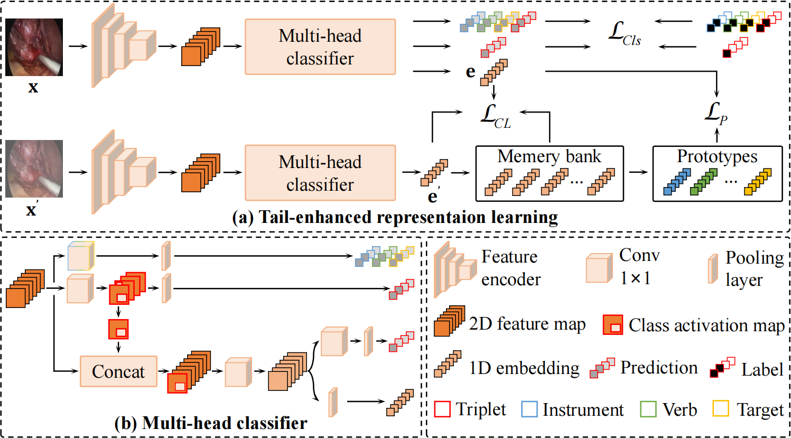

# Tail-Enhanced Representation Learning for Surgical Triplet Recognition

<i>Shuangchun Gui and Zhenkun Wang</i>



This repository contains the pytorch implementation code and evaluation scripts. <br />


## Installation
```
conda env create -f environment.yaml
```
The code has been test on Linux operating system. It runs on both CPU and GPU.
Equivalence of basic OS commands such as _unzip, cd, wget_, etc. will be needed to run in Windows or Mac OS.

<br />

## Data Preparation
Download [CholecT45 dataset](https://forms.gle/jTdPJnZCmSe2Daw7A)

<details>
  <summary>  
 Expand this to visualize the dataset directory structure.
  </summary>
  
  ```
    ──CholecT45
        ├───data
        │   ├───VID01
        │   │   ├───000000.png
        │   │   ├───000001.png
        │   │   ├───000002.png
        │   │   ├───
        │   │   └───N.png
        │   ├───VID02
        │   │   ├───000000.png
        │   │   ├───000001.png
        │   │   ├───000002.png
        │   │   ├───
        │   │   └───N.png
        │   ├───
        │   ├───
        │   ├───
        │   |
        │   └───VIDN
        │       ├───000000.png
        │       ├───000001.png
        │       ├───000002.png
        │       ├───
        │       └───N.png
        |
        ├───triplet
        │   ├───VID01.txt
        │   ├───VID02.txt
        │   ├───
        │   └───VIDNN.txt
        |
        ├───instrument
        │   ├───VID01.txt
        │   ├───VID02.txt
        │   ├───
        │   └───VIDNN.txt
        |
        ├───verb
        │   ├───VID01.txt
        │   ├───VID02.txt
        │   ├───
        │   └───VIDNN.txt
        |
        ├───target
        │   ├───VID01.txt
        │   ├───VID02.txt
        │   ├───
        │   └───VIDNN.txt
        |
        ├───dict
        │   ├───triplet.txt
        │   ├───instrument.txt
        │   ├───verb.txt
        │   ├───target.txt
        │   └───maps.txt
        |
        ├───LICENSE
        └───README.md
   ```
</details>

<br>

## Evaluation

## Training

## Acknowledgements
TERL's implementation is based on the code of [RDV](https://github.com/CAMMA-public/rendezvous), [Q2L](https://github.com/SlongLiu/query2labels), and [SAHC](https://github.com/xmed-lab/SAHC). Thanks to them.


## Citation

If this code is useful for your research, please consider citing:

  ```shell
@ARTICLE{111,
  author={Gui, Shuangchun and Wang, Zhenkun},
  title={Tail-Enhanced Representation Learning for Surgical Triplet Recognition},
  booktitle={International Conference on Medical Image Computing and Computer-Assisted Intervention},
  pages={1--1},
  year={2024},
  organization={Springer}}
  ```

## Note
* Contact: Shuangchun Gui (12132667@mail.sustech.edu.cn)