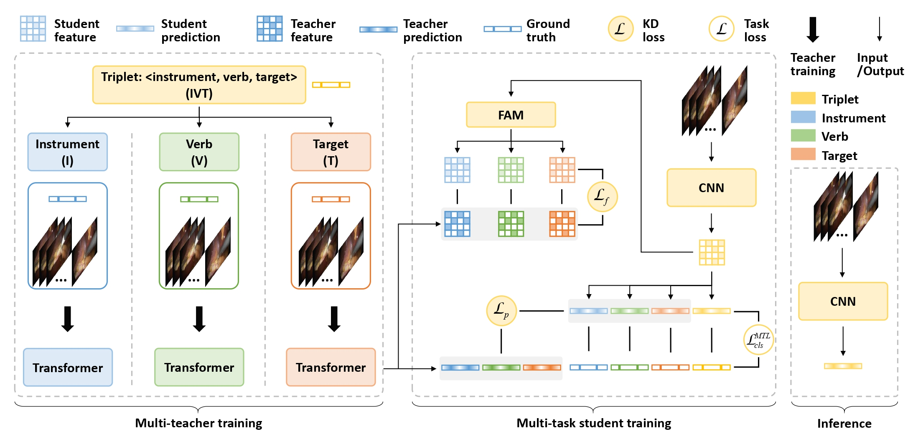

# **MT4MTL-KD**: A Multi-teacher Knowledge Distillation Framework for Triplet Recognition

<i>Shuangchun Gui, Zhenkun Wang, Jixiang Chen, Xun Zhou, Chen Zhang, and Yi Cao</i>



This repository contains the implementation code, inference demo, and evaluation scripts. <br />


# Performance

## Results Table


||Components AP ||||| Association AP |||
:---:|:---:|:---:|:---: |:---:|:---:|:---:|:---:|:---:|
AP<sub>I</sub> | AP<sub>V</sub> | AP<sub>T</sub> ||| AP<sub>IV</sub> | AP<sub>IT</sub> | AP<sub>IVT</sub> |
89.87 | 70.60 | 50.20 ||| 41.84 | 44.25 | 35.88 |

<br />


# Installation

## Requirements

The model depends on the following libraries:
1. sklearn
2. PIL
3. Python >= 3.5
4. ivtmetrics
5. Developer's framework:
    3. For PyTorch version:
        - Pyorch >= 1.10.1
        - TorchVision >= 0.11

<br />

## System Requirements:
The code has been test on Linux operating system. It runs on both CPU and GPU.
Equivalence of basic OS commands such as _unzip, cd, wget_, etc. will be needed to run in Windows or Mac OS.

<br />

## Quick Start
* clone the git repository: ``` git clone https://github.com/CAMMA-public/rendezvous.git ```
* install all the required libraries according to chosen your framework.
* download the dataset
* download model's weights
* train
* evaluate

<br />


## Docker Example

coming soon . . .

<br />


# Dataset Zoo

* [CholecT45](https://github.com/CAMMA-public/cholect45) 
* [CholecT50](https://github.com/CAMMA-public/cholect50) 
* [Dataset splits](https://arxiv.org/abs/2204.05235)

<br />


## Data Preparation

* All frames are resized to 256 x 448 during training and evaluation.
* Image data are mean normalized.
* The dataset variants are tagged in this code as follows: 
   - cholect50 = CholecT50 with split used in the original paper.
   - cholect50-challenge = CholecT50 with split used in the CholecTriplet challenge.
   - cholect45-crossval = CholecT45 with official cross-val split **(currently public released)**.
   - cholect50-crossval = CholecT50 with official cross-val split.

<br />


## Evaluation Metrics

The *ivtmetrics* computes AP for triplet recognition. It also support the evaluation of the recognition of the triplet components.

```
pip install ivtmetrics
```

or

```
conda install -c nwoye ivtmetrics
```

Usage guide is found on [pypi.org](https://pypi.org/project/ivtmetrics/).

<br />


# Running the Model

The code can be run in a trianing mode (`-t`) or testing mode (`-e`)  or both (`-t -e`) if you want to evaluate at the end of training :

<br />

## Training on CholecT45/CholecT50 Dataset

Simple training on CholecT50 dataset:

```
python run.py -t  --data_dir="/path/to/dataset" --dataset_variant=cholect50 --version=1
```

You can include more details such as epoch, batch size, cross-validation and evaluation fold, weight initialization, learning rates for all subtasks, etc.:

```
python3 run.py -t -e  --data_dir="/path/to/dataset" --dataset_variant=cholect45-crossval --kfold=1 --epochs=180 --batch=64 --version=2 -l 1e-2 1e-3 1e-4 --pretrain_dir='path/to/imagenet/weights'
```

All the flags can been seen in the `run.py` file.
The experimental setup of the published model is contained in the paper.

<br />

## Testing

```
python3 run.py -e --data_dir="/path/to/dataset" --dataset_variant=cholect45-crossval --kfold 3 --batch 32 --version=1 --test_ckpt="/path/to/model-k3/weights"
```

<br />

 ## Training on Custom Dataset

Adding custom datasets is quite simple, what you need to do are:
- organize your annotation files in the same format as in [CholecT45](https://github.com/CAMMA-public/cholect45) dataset. 
- final model layers can be modified to suit your task by changing the class-size (num_tool_classes, num_verb_classes, num_target_classes, num_triplet_classes) in the argparse.

<br />


# Model Zoo

* **N.B.** Download links to models' weights will not be provided until after the CholecTriplet2022 challenge.


## PyTorch

| Network   | Base      | Resolution | Dataset   | Data split  |  Model Weights    |
------------|-----------|------------|-----------|-------------|-------------------|
| Rendezvous| ResNet-18 | Low        | CholecT50 | RDV         |   [Download]()<!--(https://s3.unistra.fr/camma_public/github/rendezvous/rendezvous_l8_cholect50_batchnorm_lowres.pth)--> |
| Rendezvous| ResNet-18 | High       | CholecT50 | RDV         |   [Download] |
| Rendezvous| ResNet-18 | Low        | CholecT50 | Challenge   |   [Download](https://s3.unistra.fr/camma_public/github/rendezvous/rendezvous_l8_cholect50_challenge_k0_batchnorm_lowres.pth) |
| Rendezvous| ResNet-18 | Low        | CholecT50 | crossval k1 |   [Download](https://s3.unistra.fr/camma_public/github/rendezvous/rendezvous_l8_cholect50_crossval_k1_layernorm_lowres.pth) |
| Rendezvous| ResNet-18 | Low        | CholecT50 | crossval k2 |   [Download](https://s3.unistra.fr/camma_public/github/rendezvous/rendezvous_l8_cholect50_crossval_k2_layernorm_lowres.pth) |
| Rendezvous| ResNet-18 | Low        | CholecT50 | crossval k3 |   [Download](https://s3.unistra.fr/camma_public/github/rendezvous/rendezvous_l8_cholect50_crossval_k3_layernorm_lowres.pth) |
| Rendezvous| ResNet-18 | Low        | CholecT50 | crossval k4 |   [Download](https://s3.unistra.fr/camma_public/github/rendezvous/rendezvous_l8_cholect50_crossval_k4_layernorm_lowres.pth) |
| Rendezvous| ResNet-18 | Low        | CholecT50 | crossval k5 |   [Download](https://s3.unistra.fr/camma_public/github/rendezvous/rendezvous_l8_cholect50_crossval_k5_layernorm_lowres.pth) |
| Rendezvous| ResNet-18 | Low        | CholecT45 | crossval k1 |   [Download](https://s3.unistra.fr/camma_public/github/rendezvous/rendezvous_l8_cholect45_crossval_k1_layernorm_lowres.pth) |
| Rendezvous| ResNet-18 | Low        | CholecT45 | crossval k2 |   [Download](https://s3.unistra.fr/camma_public/github/rendezvous/rendezvous_l8_cholect45_crossval_k2_layernorm_lowres.pth) |
| Rendezvous| ResNet-18 | Low        | CholecT45 | crossval k3 |   [Download](https://s3.unistra.fr/camma_public/github/rendezvous/rendezvous_l8_cholect45_crossval_k3_layernorm_lowres.pth) |
| Rendezvous| ResNet-18 | Low        | CholecT45 | crossval k4 |   [Download](https://s3.unistra.fr/camma_public/github/rendezvous/rendezvous_l8_cholect45_crossval_k4_layernorm_lowres.pth) |
| Rendezvous| ResNet-18 | Low        | CholecT45 | crossval k5 |   [Download](https://s3.unistra.fr/camma_public/github/rendezvous/rendezvous_l8_cholect45_crossval_k5_layernorm_lowres.pth) |


<br />

## TensorFlow v1

| Network   | Base      | Resolution | Dataset   | Data split    | Link             |
------------|-----------|------------|-----------|---------------|------------------|
| Rendezvous| ResNet-18 | High       | CholecT50 | RDV           |  [Download] |
| Rendezvous| ResNet-18 | High       | CholecT50 | Challenge     |  [Download] |
| Rendezvous| ResNet-18 | High       | CholecT50 | Challenge     |  [Download] |

<br />


## TensorFlow v2

| Network   | Base      | Resolution | Dataset   | Data split    | Link             |
------------|-----------|------------|-----------|---------------|------------------|
| Rendezvous| ResNet-18 | High       | CholecT50 | RDV           |   [Download] |
| Rendezvous| ResNet-18 | Low        | CholecT50 | RDV           |   [Download] |


<br />

## Baseline Models

TensorFlow v1
| Model | Layer Size | Ablation Component |AP<sub>IVT</sub> | Link |
------------|------|------------|------|-----|
|Rendezvous | 1 | Proposed | 24.6 | [Download] |
|Rendezvous | 2 | Proposed | 27.0 | [Download] |
|Rendezvous | 4 | Proposed | 27.3 | [Download] |
|Rendezvous | 8 | Proposed | 29.9 | [Download] |
|Rendezvous | 8 | Patch sequence | 24.1 | [Download] |
|Rendezvous | 8 | Temporal sequence | --.-- | [Download] |
|Rendezvous | 8 | Single Self Attention Head | 18.8 | [Download] |
|Rendezvous | 8 | Multiple Self Attention Head | 26.1 | [Download] |
|Rendezvous | 8 | CholecTriplet2021 Challenge Model | 32.7| [Download] |
------------

Model weights are released periodically because some training are in progress.

<br /><br />


------------
# License


This code, models, and datasets are available for **non-commercial scientific research purposes** provided by [CC BY-NC-SA 4.0 LICENSE](https://creativecommons.org/licenses/by-nc-sa/4.0/) attached as [LICENSE file](LICENSE). 
By downloading and using this code you agree to the terms in the [LICENSE](LICENSE). Third-party codes are subject to their respective licenses.


<br />

------

# Acknowledgment

This work was supported by French state funds managed within the Investissements d'Avenir program by BPI France in the scope of ANR project CONDOR, ANR Labex CAMI, ANR DeepSurg, ANR IHU Strasbourg and ANR National AI Chair AI4ORSafety.
We thank the research teams of IHU and IRCAD  for their help in the initial annotation of the dataset during the CONDOR project.

<br />

       


<br />

<br />


------

# Related Resources
<b>
   
-  CholecT45 / CholecT50 Datasets
   [](http://camma.u-strasbg.fr/datasets)    [](https://github.com/CAMMA-public/cholect45)   
-  Offical Dataset Splits 
   [](https://arxiv.org/abs/2204.05235)
-  Tripnet 
   [](https://arxiv.org/abs/2007.05405)    [](https://github.com/CAMMA-public/tripnet)   
-  Attention Tripnet
   [](https://arxiv.org/abs/2109.03223)    [](https://github.com/CAMMA-public/attention-tripnet) 
-  CholecTriplet2021 Challenge
   [](https://cholectriplet2021.grand-challenge.org)     [](https://arxiv.org/abs/2204.04746)    [](https://github.com/CAMMA-public/cholectriplet2022) 
-  CholecTriplet2022 Challenge
   [](https://cholectriplet2022.grand-challenge.org)    [](https://github.com/CAMMA-public/cholectriplet2022)
 
</b>

<br />


------

# Citation
If you find this repo useful in your project or research, please consider citing the relevant publications:

- For the CholecT45/CholecT50 Dataset:
```
@article{nwoye2021rendezvous,
  title={Rendezvous: Attention Mechanisms for the Recognition of Surgical Action Triplets in Endoscopic Videos},
  author={Nwoye, Chinedu Innocent and Yu, Tong and Gonzalez, Cristians and Seeliger, Barbara and Mascagni, Pietro and Mutter, Didier and Marescaux, Jacques and Padoy, Nicolas},
  journal={Medical Image Analysis},
  volume={78},
  pages={102433},
  year={2022}
}
```


- For the CholecT45/CholecT50 Official Dataset Splits:
```
@article{nwoye2022data,
  title={Data Splits and Metrics for Benchmarking Methods on Surgical Action Triplet Datasets},
  author={Nwoye, Chinedu Innocent and Padoy, Nicolas},
  journal={arXiv preprint arXiv:2204.05235},
  year={2022}
}
```


- For the Rendezvous or Attention Tripnet Baseline Models or any snippet of code from this repo:
```
@article{nwoye2021rendezvous,
  title={Rendezvous: Attention Mechanisms for the Recognition of Surgical Action Triplets in Endoscopic Videos},
  author={Nwoye, Chinedu Innocent and Yu, Tong and Gonzalez, Cristians and Seeliger, Barbara and Mascagni, Pietro and Mutter, Didier and Marescaux, Jacques and Padoy, Nicolas},
  journal={Medical Image Analysis},
  volume={78},
  pages={102433},
  year={2022}
}
```

- For the Tripnet Baseline Model:
```
@inproceedings{nwoye2020recognition,
   title={Recognition of instrument-tissue interactions in endoscopic videos via action triplets},
   author={Nwoye, Chinedu Innocent and Gonzalez, Cristians and Yu, Tong and Mascagni, Pietro and Mutter, Didier and Marescaux, Jacques and Padoy, Nicolas},
   booktitle={International Conference on Medical Image Computing and Computer-Assisted Intervention (MICCAI)},
   pages={364--374},
   year={2020},
   organization={Springer}
}
```


- For the models presented @ CholecTriplet2021 Challenge:
```
@article{nwoye2022cholectriplet2021,
  title={CholecTriplet2021: a benchmark challenge for surgical action triplet recognition},
  author={Nwoye, Chinedu Innocent and Alapatt, Deepak and Vardazaryan, Armine ... Gonzalez, Cristians and Padoy, Nicolas},
  journal={arXiv preprint arXiv:2204.04746},
  year={2022}
}
```

#
This repo is maintained by [CAMMA](http://camma.u-strasbg.fr). Comments and suggestions on models are welcomed. Check this page for updates.